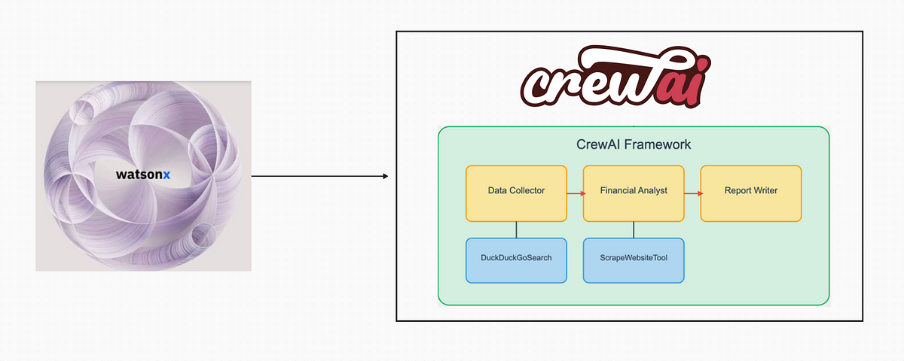

# Meetup watsonx.ai + CrewAI: Marketing Analyst!

### Overview

This code sets up a CrewAI environment with agents who collaborate to analyze market demand, assess technological feasibility, and evaluate business models for a product. It integrates IBM Watsonx's LLM for generating insights and Streamlit for a user-friendly interface.




### Requirements 

Make sure to install the requirements 

```python
pip install -r requirements.txt
```

### Run the streamlit app: 

```python
 streamlit run main.py
```


[Link to the recorded video (in French)](https://youtu.be/GbjIuwgBhwI)

